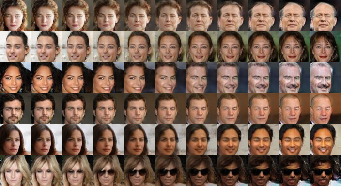

# RP-GAN: Stable GAN Training with Random Projections


This repository contains a reference implementation of the algorithm described in the paper:

> Behnam Neyshabur, Srinadh Bhojanapalli, and Ayan Chakrabarti, "[**Stabilizing GAN Training with Multiple Random Projections**](http://arxiv.org/abs/1705.07831)," arXiv:1705.07831 [cs.LG], 2017.

Pre-trained generator models are not included in the repository due to their size, but are available as binary downloads as part of the [release](https://github.com/ayanc/rpgan/releases). This code and data is being released for research use. If you use the code in research that results in a publication, we request that you kindly cite the above paper. Please direct any questions to <ayanc@ttic.edu>.

##### Requirements

The code uses the [tensorflow](https://www.tensorflow.org/) library, and has been tested with versions `0.9` and `0.11` with both Python2 and Python3. You will need a modern GPU for training in a reasonable amount of time, but the sampling code should work on a CPU.

## Sampling with Trained Models

We first describe usage of scripts for sampling from trained models. You can use these scripts for models you train yourself, or use the provided pre-trained models.

##### Pre-trained Models
We provide a number of pre-trained models in the [release](https://github.com/ayanc/rpgan/releases), corresponding to the experiments in the paper. The parameters of each model (both for training and sampling) are described in `.py` files the `exp/` directory. `face1.py` describes a face image model trained in the traditional setting with a single discriminator, while `faceNN.py` are models trained with multiple discriminators each acting on one of *NN* random low-dimensional projections. `face48.py` describes the main face model used in our experiments, while `dog12.py` is the model trained with 12 discriminators on the Imagenet-Canines set. After downloading the trained model archive files, unzip them in the repository root directory. This should create files in sub-directories of `models/`. 

##### Generating Samples
Use `sample.py` to generate samples using any of trained models as:
```bash
$ ./sample.py expName[,seed] out.png [iteration]
```
where `expName` is the name of the experiment file (without the `.py` extension), and `out.png` is the file to save the generated samples to. The script accepts optional parameters: `seed` (default 0) specifies the random seed used to generate the noise vectors provided to the generator, and `iteration` (default: max iteration available as saved file) specifies which model file to use in case multiple snapshots are available. E.g.,

```bash
$ ./sample.py face48 out.png      # Sample from the face48 experiment, using 
                                  # seed 0, and the latest model file.
$ ./sample.py face48,100 out.png  # Sample from the face48 experiment, using
                                  # seed 100, and the latest model file.
$ ./sample.py face1 out.png       # Sample from the single discriminator face
                                  # experiment, and the latest model file.
$ ./sample.py face1 out.png 40000 # Sample from the single discriminator face
                                  # experiment, and the 40k iterations model.
```

##### Interpolating in Latent Space

We also provide a script to produce interpolated images like the ones at the top of this page. However, before you can use this script, you need to create a version of the model file that contains the population mean-variance statistics of the activations to be used in batch-norm la(`sample.py` above uses batch norm statistics which is fine since it is working with a large batch of noise vectors. However, for interpolation, you will typically be working with smaller, more correlated, batches, and therefore should use batch statistics).

To create this version of the model file, use the provided script `fixbn.py` as:
```bash
$ CUDA_VISIBLE_DEVICES= ./fixbn.py expName [iteration]
```
This will create a second version of the model weights file (with extension `.bgmodel.npz` instead of `.gmodel.npz`) that also stores the batch statistics. Like for `sample.py`, you can provide a second optional argument to specify a specific model snapshot corresponding to an iteration number.

Note that we call the script with `CUDA_VISIBLE_DEVICES=` to force **tensorflow** to use the CPU instead of the GPU. This is because we compute these stats over a relatively large batch which typically doesn't fit in GPU memory (and since it's only one forward pass, running time isn't really an issue).

You only need to call `fixbn.py` once, and after that, you can use the script `interp.py` to create interpolated samples. The script will generate multiple rows of images, each producing samples from noise vectors interpolated between a pair from left-to-right. The script lets you specify these pairs of noise vectors as IDs:
```bash
$ ./interp.py expName[,seed[,iteration]] out.png lid,rid lid,rid ....
```
The first parameter now has two optional comma-separated arguments beyond the model name for seed and iteration. After this and the output file name, it agrees an arbitrary number of pairs of left-right image IDs, for each row of desired images in the output. These IDs correspond to the number of the image, in reading order, in the output generated by `sample.py` (with the same seed). For example, to create the images at the top of the page, use:
```bash
$ ./interp.py face48 out.png 137,65 146,150 15,138 54,72 38,123 36,93
```

## Training

To train your own model, you will need to create a new model file (say `myown.py`) in the `exp/` directory. See the existing model files for reference. Here is an explanation of some of the key parameters:

- `wts_dir`: Directory in which to store model weights. This directory must already exist.
- `imsz`: Resolution / Size of the images (will be square color images of size `imsz x imsz`).
- `lfile`: Path to a list file for the images you want to train on, where each line of the file contains a path to an image.
- `crop`: Boolean (`True` or `False`). Indicates whether the images are already the correct resolution, or need to be cropped. If `True`, these images will first be resized so that the smaller side matches `imsz`, and then a random crop along the other dimension will be used for training.

Before you begin training, you will need to create a file called `filts.npz` which defines the convolutional filters for the random projections. See the `filts/` directory for the filters used for the pre-trained models, as well as instructions on a script for creating your own. On

Once you have created the model file and prepared the directory, you can begin training by using the `train.py` script as:
```bash
$ ./train.py myown
```
where the first parameter is the name of your model file.

We also provide a script for traditional training---`baseline_train.py`---with a single discriminator acting on the original image. It is used in the same way, except it doesn't require a `filts.npz` file in the weights directory.

***

### Acknowledgments

This work was supported by the National Science Foundation under award no. [IIS-1820693](http://www.nsf.gov/awardsearch/showAward?AWD_ID=1820693). Any opinions, findings, and conclusions or recommendations expressed in this material are those of the authors, and do not necessarily reflect the views of the National Science Foundation.
